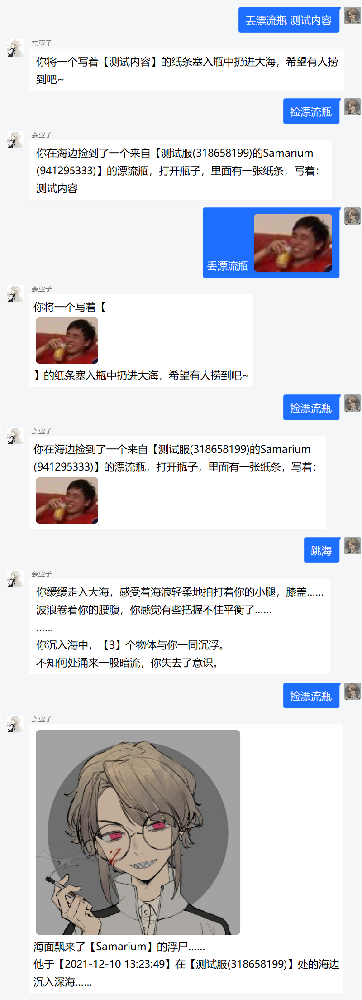

# mirai-console-drift-bottle

简单的漂流瓶插件，基本照抄了`Dice!`项目的漂流瓶功能

可以在私聊或者群聊中丢出包含任意消息的漂流瓶, 其他人通过捡起漂流瓶即可看到相应的消息

也可以通过跳海来查看海里有多少物品

具体使用文档放在了 [wiki](https://github.com/Samarium150/mirai-console-drift-bottle/wiki) 页面

下图是功能演示

